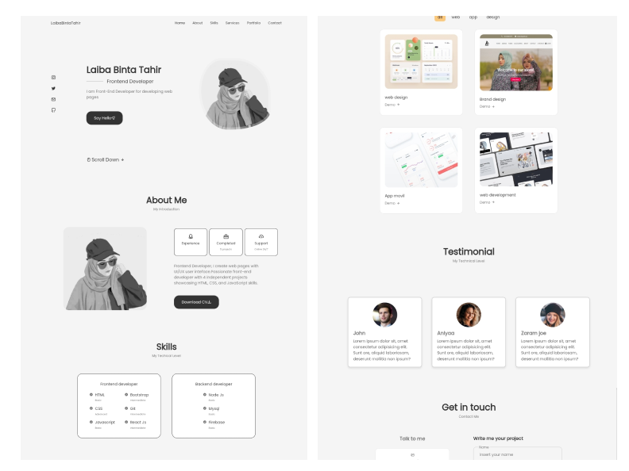
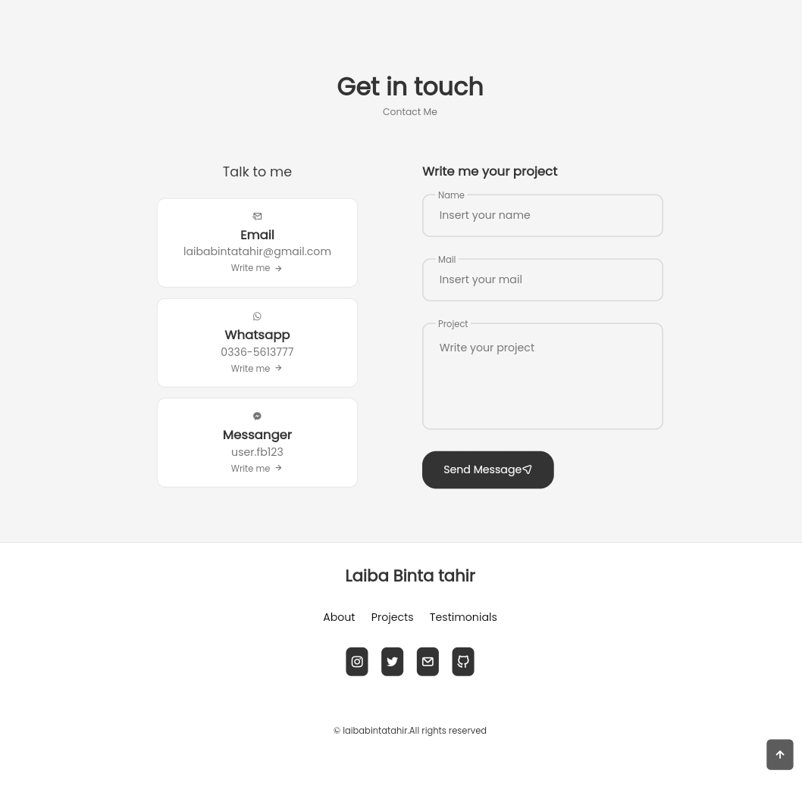

# React Portfolio Project

![Project Banner][]


Welcome to my React Portfolio Project! This project showcases my skills in web development using the React framework. Here, I've designed and developed a personal portfolio website to exhibit my projects, skills, and experience in an interactive and visually appealing manner.

## Table of Contents

- [Demo](#demo)
- [Features](#features)
- [Technologies Used](#technologies-used)
- [Installation](#installation)
- [Usage](#usage)
- [Deployment](#deployment)
- [License](#license)

## Demo

Check out the live demo of the portfolio project [here](https://laiba-portfolio.vercel.app/).

## Features

- **Responsive Design**: The portfolio is designed to be responsive, ensuring a seamless experience across various devices and screen sizes.
- **Project Showcase**: Display your completed projects with detailed information, including project descriptions, technologies used, and live demos or screenshots.
- **Skills Highlight**: Highlight your technical skills and areas of expertise.
- **About Me**: Introduce yourself and provide a brief overview of your background, education, and work experience.
- **Contact Information**: Include your contact details or a contact form for potential employers or collaborators to reach out.
- **Customization**: Easily customize the portfolio content, including projects, skills, and personal information, by editing the provided data files.
- **Smooth Animations**: Incorporate smooth animations and transitions to enhance the visual appeal of the portfolio.

## Technologies Used

- React
- HTML5
- CSS3 (with CSS Modules for styling)
- [React Router](https://reactrouter.com/) for routing within the application
- [IconScout](https://iconscout.com//) for icons

## Installation

1. Clone the repository:

```bash
git clone https://github.com/laibabintatahir/my-portfolio.git
```

2. Install the dependencies:

```bash
npm install
```

## Usage

1. Run the development server:

```bash
npm start
```

2. Open your web browser and navigate to `http://localhost:3000` to see the portfolio in action.

## Deployment

Deployed on Vercel

## License

This project is licensed under the [MIT License](LICENSE).

---

Thank you for checking out my React Portfolio Project! If you have any questions or suggestions, feel free to contact me at laibabintatahir@gmail.com.

[Portfolio-Website](https://laiba-portfolio.vercel.app/)
[LinkedIn](https://www.linkedin.com/in/laiba-binta-tahir/)
[GitHub](https://github.com/laibabintatahir)

[def]: Portfolio.png